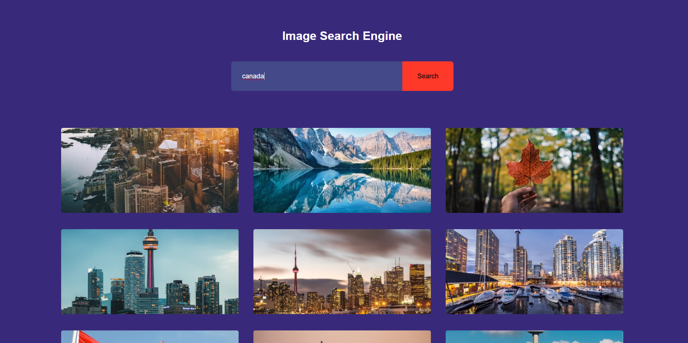

# 🔍 Image Search Engine

A modern, lightweight, and responsive image search application built with **HTML, CSS, and JavaScript**. It uses the **Unsplash API** to fetch high-quality images based on user queries.

---

## 🚀 Features

- 🔎 **Real-time Keyword Search** – Fetches relevant images from Unsplash
- 🖼️ **Image Grid Display** – Responsive layout using CSS Grid
- 📄 **Pagination Support** – "Show More" button loads more results
- ⚡ **Fast & Clean UI** – Optimized for simplicity and speed

---

## 📸 Preview

---

## 🛠️ Tech Stack

| Technology    | Purpose                     |
|---------------|-----------------------------|
| HTML5         | Structure of the app        |
| CSS3          | Styling and responsiveness  |
| JavaScript    | Logic and API integration   |
| Unsplash API  | Image data source           |

---
